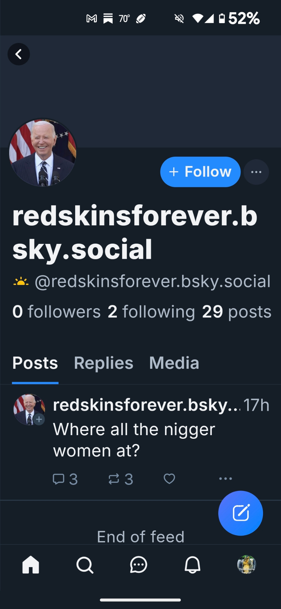
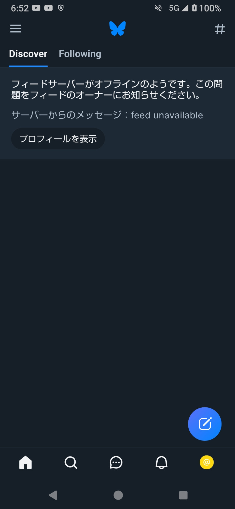
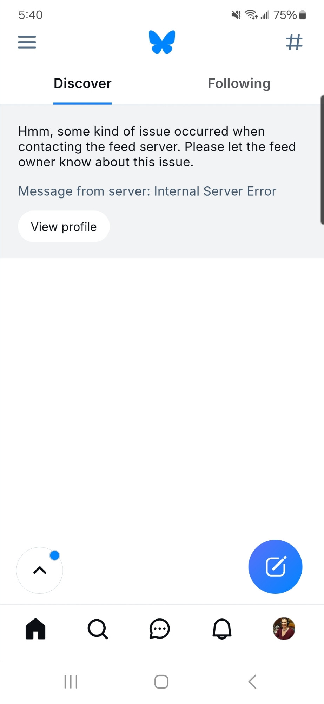

[1] **Bluesky** (@bsky.app):
👋  Bluesky is an open social network that gives creators independence from platforms, developers the freedom to build, and users a choice in their experience. We're so excited to have you here! 

We share Bluesky updates & news from this account. A quick orientation thread: 🧵✨

[1.1] **Bluesky** (@bsky.app):
• Anyone can create and subscribe to feeds. There are 50k+ feeds here, like posts from mutuals, news, or cat photos!

bsky.app/feeds

• The Discover feed shows you posts that we think you'll like. Help us fine-tune it for you by using the "Show more" & "Show less" buttons in the three-dot menu.

[1.2] **Elle Esse 🖇️** (@relentles99.bsky.social):
📌

[1.3] **Ali** (@srdelfino.bsky.social):
Galera, vou sair fora daqui, as minhas publicações não engajam e não apareço em nenhum feed, falo as publicações do meu perfil, aí está sendo inútil. Já fiz de tudo e nada. Todos aparecem nos feeds, eu não  .... @bsky.app

[1.4] **Mind Over Matter ...** (@adawehi369.bsky.social):
How do we see what people are responding to.  It says "responding to you" but I have not found a way to go back and see which post or comment.  Very frustrating.  I sent an email You said you would answer soon but nothing more......  Help a soul out would ya ....

[1.5] **🍁MeidasMike - Michael BALLARD** (@bonfiremedia.bsky.social):
my feeds are not working

[1.6] **Leslie Sherman** (@lesliesherman.bsky.social):
Thanks for the safe room!!

[1.7] **Cat Daddy** (@johncbaileyactor.bsky.social):
Better gatekeeping is the reason I came here. If this account exists more than 48 hours, I will simply decide that I don't need a Twitter like community which will then be on you. The use of the n-word and the use of the word Redskins, this is the hate we were escaping

[1.8] **Tess** (@queen-countessa.bsky.social):
💙

[1.9] **johnfordemocracy** (@jfordemocracy.bsky.social):
I noticed the remove quote option; thanks. Another thing I think would be helpful is the remove follower option because right now, the only way I can do that is block them. 

Wonderful network, BTW!

[1.10] **LogicQuester** (@wqrwqet.bsky.social):
Posting the same content in Chinese only uses 79 characters, while posting it in English shows more than 300 characters, exceeding the character limit for posts. However, meeting the requirement of less than 300 characters would not fully convey the message. How can this issue be resolved?

[1.11] **Jennifer of the Malcontents** (@bubblehead29.bsky.social):
📌

[1.12] **ScienceBased 🎗️** (@scientificprin.bsky.social):
📌

[1.13] **ScienceBased 🎗️** (@scientificprin.bsky.social):
📌

[1.14] **Mortiffa** (@xmortiffax.bsky.social):
💜👽💜

[1.15] **Anita maxwin** (@lyfestyletwin.bsky.social):
I can tell you about a Unique Feature that no one has created on their apps and can be on Bluesky,  it will be a unique way to express "free Speech".  Let's talk.

[1.16] **D** (@deebraybrook.bsky.social):
Is there any way to do verification (without costing too much?) I’m getting mixed messages about the people I follow ie if they are real or not. Thanks I’m sure your inundated with messages considering your popularity 💙

[1.17] **THE LONE HOPEFUL ONE** (@shenda.bsky.social):
I KNOW IM PUTTING THIS ON ANOTHER POST BUT MY POST BUTTON IS MISSING AND ITS TELLIN ME I NEED TO LET SOMEONE  KNOW THE "FEED SERVER" IS DOWN ? I CAN SEE THING BUT I CANT SEE THE STUFF  ON MY HOME BUTTON

[1.18] **dárklight** (@daarrrko.bsky.social):
thank you #Bluesky for saving us from #X after #ElonMusk killed off #Twitter✌️💜

[1.19] **** (@ashterve.bsky.social):
whatsapp.com/channel/0029...

[1.20] **** (@harukumaodi.bsky.social):
対応お願いします

[1.21] **** (@geosim1.bsky.social):
Exit from X seems a 😅 relief

[1.22] **theanimaltalker** (@suepikeenergy.bsky.social):
I'm having problems with my feed.

[1.23] **Colleen Cassel** (@ccasselrealestate.bsky.social):
Thank you!  Congratulations on your success

[1.24] **** (@antonmartinlopez.bsky.social):
👍

[1.25] **Black trans lives matter ** (@blacktranslives.bsky.social):
Soon @bsky.app platform will be only white cis people. They have started spamming black trans siblings on here. 

We must find a new platform that doesn’t discriminate. 

@transnormative.bsky.social @notthatcaltrans.bsky.social @thetransfemininereview.com

[1.26] **Black trans lives matter ** (@blacktranslives.bsky.social):
@bsky.app is transphobic and racist.

[1.27] **Jonathan Pfeifer** (@jpfeifer14.bsky.social):
It would definitely be helpful to implement, at bare minimum, the ability to limit audience and potentially even private groups/feeds. That is one reason I never liked twitter, everything is public all the time

[1.28] **** (@chulito547.bsky.social):
Can you do a section of videos like TikTok, since is getting banned? And have a similar algorithm?

[1.29] **Ria** (@riathegamer.bsky.social):
I was told (not really xD) that there would be more skies here and they're blue, where are they? oh yeah, it's here :P

anyway it's very nice to be here, keep up the good work guys :)

[1.30] **Ana Miranda** (@anamirandapt.bsky.social):
Thank you for beeing here for us 🥰

[1.31] **Calvin Anderson ** (@calvin-andy.bsky.social):
Guys follow me, I will follow back asap...I promise☺️

[1.32] **angie mclaren** (@thebestucan.bsky.social):
I'm happy to be here!

[1.33] **2Chè 🏴‍☠️🇵🇸🇱🇧💚** (@standrewspirate.bsky.social):
Do you shadow ban supporters of the Palestinian cause, just as many supporters join your site? Looking forward to a response 🤔

[1.34] **Ashley** (@lashleyl.bsky.social):
When I click the see less button can I please see less of it and NOT MORE OF IT

[1.35] **Mark Harris** (@markharris1.bsky.social):
Can I get my handle back

[1.36] **WHO is Ana ⟭⟬⁷ ** (@handle.invalid):
open.spotify.com/intl-pt/albu...

[1.37] **Mariah Hope Martinez ** (@mariah92900.bsky.social):
@thatswhen.bsky.social

[1.38] **12-ThreeFour** (@12-threefour.bsky.social):
test. will this let me post.

[1.39] **FFFFFFFyre** (@fffffffyrefly.bsky.social):
What’s the best way to organize your follows? I follow a lot of accounts for diff topics; on Twitter I would use private lists, but it doesn’t look like lists or feeds are private here. Do people get spammed with notifs if you add them to a feed/list? Which is better for personal organization?

[1.40] **Queer Joy Austin TX** (@queerjoyaustin.bsky.social):
Many of us have migrated from Twitter to Blue Sky, yet, at this time, transgender communities are facing significant harm due to the discrimination perpetuated by Bluesky. As Bluesky has silenced trans accounts. Black trans Texas, black queer Joy.

[1.41] **Queer Joy Austin TX** (@queerjoyaustin.bsky.social):
@bsky.app Your responsibility is to champion the right to free speech. You have just exercised your influence to marginalize Black trans and Black queer artists.

[1.42] **** (@fo494.bsky.social):
感謝🙏

[1.43] **** (@mauricioone.bsky.social):
What about being able to save certain pages/videos? “Saved Tabs” button?

[1.44] **Agent Eggypuss** (@eggypuss.bsky.social):
Have you thought about a Twitch alternative?  #dorsey

[1.45] **Catherine Zoltan** (@catherinezoltan.bsky.social):
Get Zelensky on Bluesky.

[1.46] **Deborah Rael-Buckley** (@raelbuckley.bsky.social):
Thanks bluesky!

[1.47] **MrKennedy** (@mrkennedyofficial.bsky.social):
Hi @bsky.app 👋🏿 
When are you going to enable the search feature for my contents only? It's a lot of pain scrolling through tons of my posts to refer to old posts. Thanks

[1.48] **Paticake** (@project2025kills.bsky.social):
I am LOVING this Starter Pack thingy!!

[1.49] **scotty27.bsky.social** (@scotty27.bsky.social):
My handle says invalid now when ya gonna fix it

